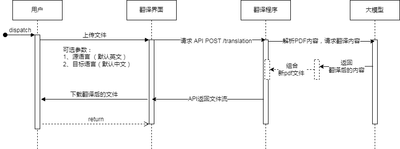

采用langchain 框架开发PDF翻译程序，通读代码输出过程笔记。

## 功能入口分为两种形式

1、可视化界面 

1.1、用户界面 gradio_server

1.2、接口服务 flask_server

2、命令行 
main.py

## 主要功能
```shell
|-- book   
|   |-- book.py    //定义书文件类，包含页面类
|   |-- content.py //定义内容类 ，分为文本、表格、图像
|   |-- page.py    //定义页面类，包含内容类
|-- translator
|   |-- exceptions.py         //超出书的页数异常
|   |-- pdf_parser.py         //PDF文件解析，支持内容跟表格，返回书文件类
|   |-- pdf_translator.py     //循环获取书每页的内容进行LLM翻译结果进行保存
|   |-- translation_chain.py  //创建提示词为语言翻译的LLM对象
|   |-- translation_config.py //进行翻译语言的设置
|   |-- writer.py             //文件保存，支持pdf跟markdown文件类型

```


## 用户使用序列图



